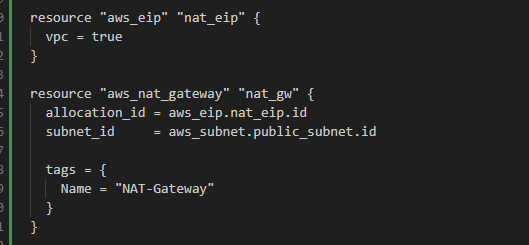
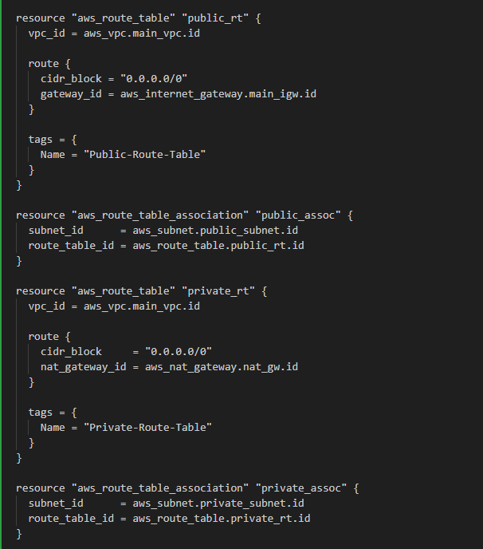
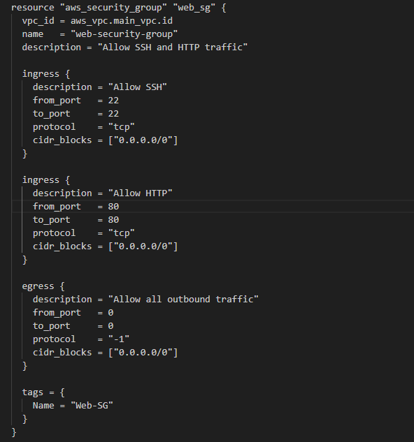
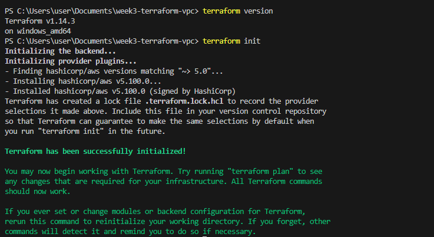
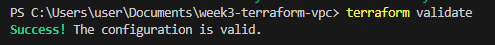
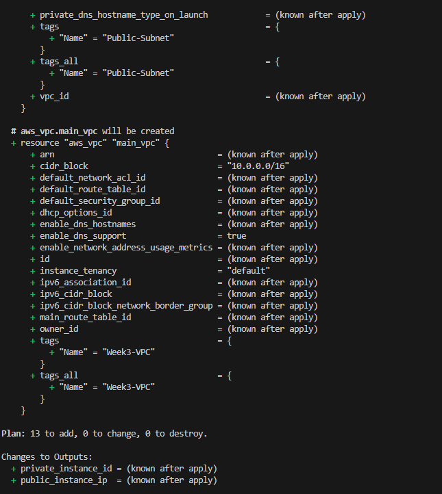
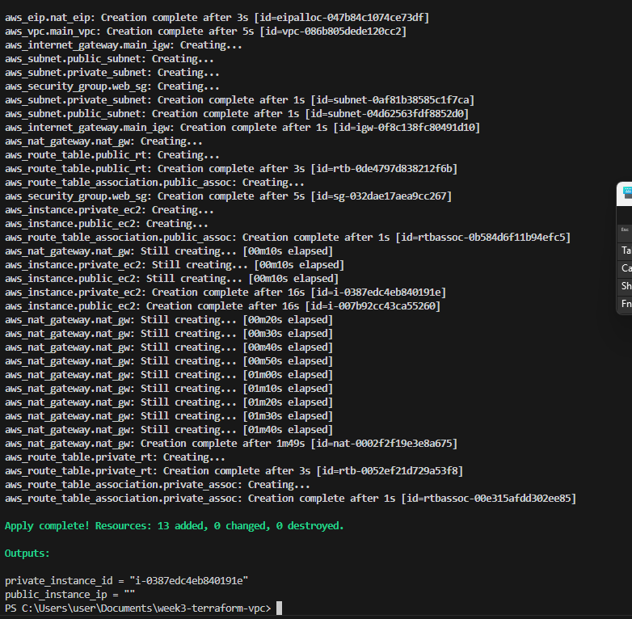
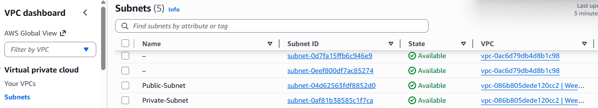
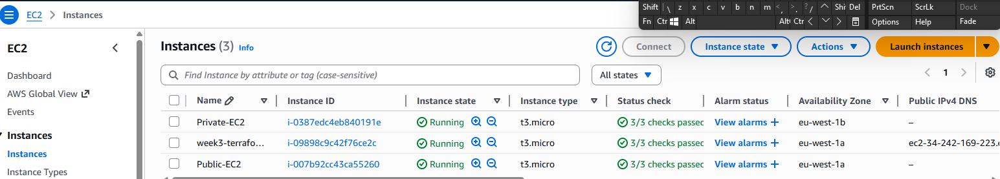
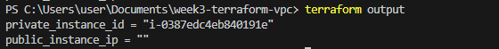

# week3-terraform-vpc
# Week 3: Infrastructure as Code (IaC) with Terraform

## 📋 Project Overview
This project demonstrates creating a custom VPC with subnets and routing using Terraform on AWS. Part of my 12-week Cloud Computing journey.

## 🎯 Objectives
- Recreate VPC setup using Infrastructure as Code
- Learn modular design and version control with Terraform
- Automate infrastructure deployment

## 🛠️ Tools & Technologies
- **Terraform** - Infrastructure as Code tool
- **AWS** - Cloud provider
- **VS Code** - Code editor
- **Git/GitHub** - Version control

## 📂 Project Structure
```
week3-terraform-vpc/
├── main.tf              # Main Terraform configuration
├── variables.tf         # Variable definitions
├── outputs.tf           # Output values
├── terraform.tfvars     # Variable values (not tracked in git)
├── .gitignore          # Git ignore file
└── screenshots/         # Documentation screenshots
```

## 🚀 Steps Taken

### Step 1: Set Up Terraform Provider


Configured AWS provider with region variable for flexibility.
```hcl
provider "aws" {
  region = var.region
}
```
### Step 2: Create VPC


Created custom VPC with CIDR block...

### Step 3: Create public subnet


Links this subnet to the VPC you created earlier (main_vpc).

### Step 4: Create private subnet


Another slice of your VPC network, separate from the public subnet.

### Step 5: Create Internet Gateway


Created an Internet Gateway to allow the VPC to communicate with the internet.

This project sets up a Virtual Private Cloud (VPC) using Terraform. It includes public and private subnets, an Internet Gateway, and variable configuration.

### Step 6: Create NAT Gateway & Elastic IP


Created an Elastic IP and NAT Gateway to allow private subnet instances to access the internet while remaining private.

**Elastic IP:**
- Allocated for NAT Gateway

**NAT Gateway:**
- Placed in the public subnet
- Uses the Elastic IP
- Enables outbound internet access for private subnet
```hcl
resource "aws_eip" "nat_eip" {
  vpc = true
}

resource "aws_nat_gateway" "nat_gw" {
  allocation_id = aws_eip.nat_eip.id
  subnet_id     = aws_subnet.public_subnet.id
  
  tags = {
    Name = "NAT-Gateway"
  }
}
```

### Step 7: Configure Route Tables


Created separate route tables for public and private subnets with appropriate routes.

**Public Route Table:**
- Routes all traffic (0.0.0.0/0) to the Internet Gateway
- Associated with the public subnet

**Private Route Table:**
- Routes all traffic (0.0.0.0/0) to the NAT Gateway
- Associated with the private subnet
```hcl
# Public Route Table
resource "aws_route_table" "public_rt" {
  vpc_id = aws_vpc.main_vpc.id
  
  route {
    cidr_block = "0.0.0.0/0"
    gateway_id = aws_internet_gateway.main_igw.id
  }
  
  tags = {
    Name = "Public-Route-Table"
  }
}

resource "aws_route_table_association" "public_assoc" {
  subnet_id      = aws_subnet.public_subnet.id
  route_table_id = aws_route_table.public_rt.id
}

# Private Route Table
resource "aws_route_table" "private_rt" {
  vpc_id = aws_vpc.main_vpc.id
  
  route {
    cidr_block     = "0.0.0.0/0"
    nat_gateway_id = aws_nat_gateway.nat_gw.id
  }
  
  tags = {
    Name = "Private-Route-Table"
  }
}

resource "aws_route_table_association" "private_assoc" {
  subnet_id      = aws_subnet.private_subnet.id
  route_table_id = aws_route_table.private_rt.id
}
```

### Step 8: Create Security Group


Created a security group to control inbound and outbound traffic for EC2 instances.

**Inbound Rules:**
- SSH (port 22) - For remote access
- HTTP (port 80) - For web traffic

**Outbound Rules:**
- All traffic allowed (0.0.0.0/0)
```hcl
resource "aws_security_group" "web_sg" {
  vpc_id      = aws_vpc.main_vpc.id
  name        = "web-security-group"
  description = "Allow SSH and HTTP traffic"
  
  ingress {
    description = "Allow SSH"
    from_port   = 22
    to_port     = 22
    protocol    = "tcp"
    cidr_blocks = ["0.0.0.0/0"]
  }
  
  ingress {
    description = "Allow HTTP"
    from_port   = 80
    to_port     = 80
    protocol    = "tcp"
    cidr_blocks = ["0.0.0.0/0"]
  }
  
  egress {
    description = "Allow all outbound traffic"
    from_port   = 0
    to_port     = 0
    protocol    = "-1"
    cidr_blocks = ["0.0.0.0/0"]
  }
  
  tags = {
    Name = "Web-SG"
  }
}
```

### Step 9: Launch EC2 Instances


Launched two EC2 instances to test the VPC setup:

**Public EC2:**
- Placed in public subnet
- Has public IP for direct internet access
- Uses web security group

**Private EC2:**
- Placed in private subnet
- No public IP (uses NAT Gateway for outbound only)
- Uses web security group
```hcl
# Public EC2 Instance
resource "aws_instance" "public_ec2" {
  ami             = "ami-049442a6cf8319180"  # Ubuntu AMI for eu-west-1
  instance_type   = "t3.micro"
  subnet_id       = aws_subnet.public_subnet.id
  security_groups = [aws_security_group.web_sg.id]
  
  tags = {
    Name = "Public-EC2"
  }
}

# Private EC2 Instance
resource "aws_instance" "private_ec2" {
  ami             = "ami-049442a6cf8319180"  # Same Ubuntu AMI
  instance_type   = "t3.micro"
  subnet_id       = aws_subnet.private_subnet.id
  security_groups = [aws_security_group.web_sg.id]
  
  tags = {
    Name = "Private-EC2"
  }
}
```

## 💡 Key Learnings
- Understanding the difference between public and private subnets
- NAT Gateway enables private instances to access the internet securely
- Route tables control traffic flow within the VPC
- Security groups act as virtual firewalls for EC2 instances
- Infrastructure as Code makes infrastructure reproducible and versionable

## 📋 Configuration Files

### variables.tf
Defines the variables used throughout the project for flexibility and reusability.
```hcl
variable "region" {
  description = "AWS region to deploy resources"
  type        = string
  default     = "eu-west-1"
}

variable "instance_type" {
  description = "EC2 instance type"
  type        = string
  default     = "t3.micro"
}

variable "ami_id" {
  description = "AMI ID for EC2 instances"
  type        = string
}
```

### terraform.tfvars
Contains the actual values for variables (excluded from git for security).
```hcl
region        = "eu-west-1"
instance_type = "t3.micro"
ami_id        = "ami-049442a6cf8319180"  # Ubuntu AMI for eu-west-1
```

### outputs.tf
Defines outputs to display important information after deployment.
```hcl
output "public_instance_ip" {
  description = "The public IP address of the EC2 instance in the public subnet"
  value       = aws_instance.public_ec2.public_ip
}

output "private_instance_id" {
  description = "The ID of the EC2 instance in the private subnet"
  value       = aws_instance.private_ec2.id
}
```
## 📊 Deployment Results

### Terraform Init


Successfully initialized Terraform and downloaded the AWS provider.

### Terraform Validate


Configuration validated successfully with no syntax errors.

### Terraform Plan


Terraform plan shows all resources that will be created: VPC, subnets, route tables, NAT gateway, security group, and EC2 instances.

### Terraform Apply


Successfully deployed all infrastructure to AWS.

### Infrastructure Verification



Verified that all resources were created successfully in the AWS Console.

### Outputs


Retrieved the public IP of the public EC2 instance and the instance ID of the private EC2.