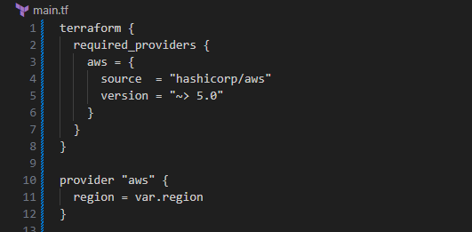
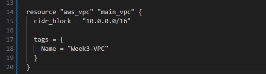
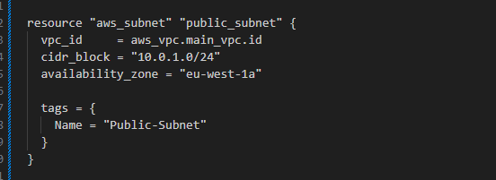
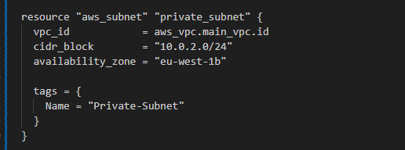
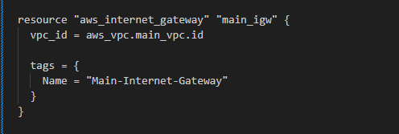

# week3-terraform-vpc
# Week 3: Infrastructure as Code (IaC) with Terraform

## 📋 Project Overview
This project demonstrates creating a custom VPC with subnets and routing using Terraform on AWS. Part of my 12-week Cloud Computing journey.

## 🎯 Objectives
- Recreate VPC setup using Infrastructure as Code
- Learn modular design and version control with Terraform
- Automate infrastructure deployment

## 🛠️ Tools & Technologies
- **Terraform** - Infrastructure as Code tool
- **AWS** - Cloud provider
- **VS Code** - Code editor
- **Git/GitHub** - Version control

## 📂 Project Structure
```
week3-terraform-vpc/
├── main.tf              # Main Terraform configuration
├── variables.tf         # Variable definitions
├── outputs.tf           # Output values
├── terraform.tfvars     # Variable values (not tracked in git)
├── .gitignore          # Git ignore file
└── screenshots/         # Documentation screenshots
```

## 🚀 Steps Taken

### Step 1: Set Up Terraform Provider


Configured AWS provider with region variable for flexibility.
```hcl
provider "aws" {
  region = var.region
}
```
### Step 2: Create VPC


Created custom VPC with CIDR block...

### Step 3: Create public subnet


Links this subnet to the VPC you created earlier (main_vpc).

### Step 4: Create private subnet


Another slice of your VPC network, separate from the public subnet.

### Step 5: Create Internet Gateway


Created an Internet Gateway to allow the VPC to communicate with the internet.

This project sets up a Virtual Private Cloud (VPC) using Terraform. It includes public and private subnets, an Internet Gateway, and variable configuration.
